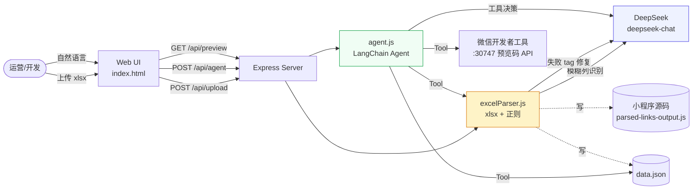
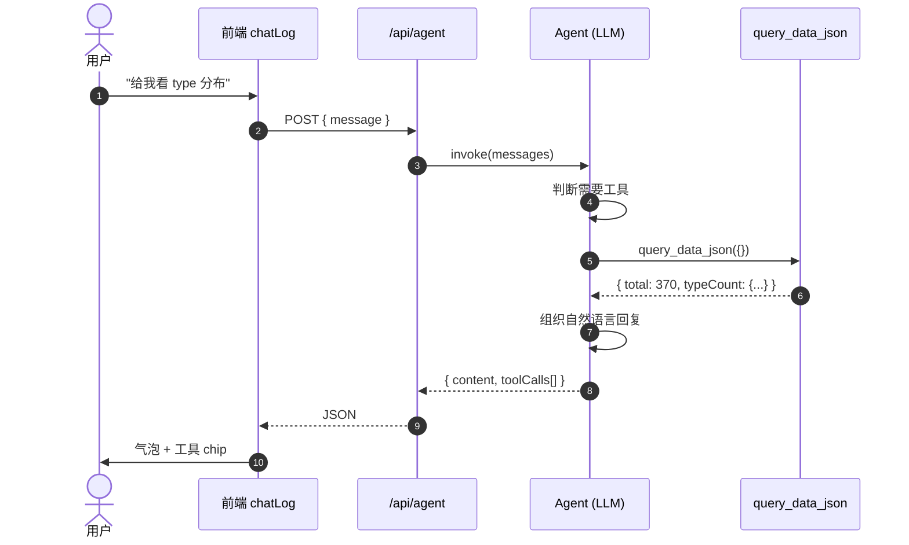
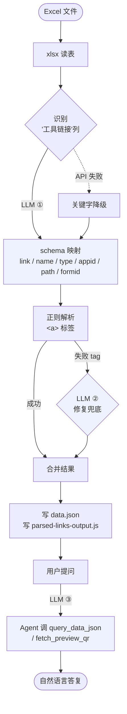

# 配图与流程图（Mermaid / ASCII）

> 复制下面的 Mermaid 代码到 [mermaid.live](https://mermaid.live) 或掘金/思否编辑器直接用。

---

## 图 1：整体架构（首屏必备）



---

## 图 2：一次 Agent 对话的完整链路（核心章节用）



---

## 图 3：LLM 在代码里的 3 个位置（"LLM 当胶水层"的直观图）



---

## 图 4：ASCII 版（公众号排版备用）

```
┌────────────────┐
│  Excel 文件     │
└────┬───────────┘
     ▼
[xlsx 读表]
     │
     ▼
┌──────────────────────────────┐
│ LLM ①：识别"工具链接"列       │
│   失败 → 关键字同义词匹配     │
└────┬─────────────────────────┘
     ▼
[正则解析 <a> 标签]
     │  ┌─── 成功 ──────────────────┐
     │  │                           │
     │  └─── 失败 ──→ LLM ② 修复    │
     │                              │
     ▼                              │
[合并 parsedLinks + repairedLinks]◄─┘
     │
     ▼
[写 data.json / parsed-links-output.js]
     │
     ▼
用户对话  ◄── LLM ③：Agent + 3 个 Tool
            query_data_json
            fetch_preview_qr
            parse_excel_to_json
```

---

## 截图占位（发布前需替换）

| 位置 | 内容 | 工具推荐 |
|---|---|---|
| 封面 GIF | 手动 12 步 vs 对话 1 句话 | LICEcap / Kap |
| 首图 | UI 全景（浅色 Swiss 风格） | macOS 自带截图 (Cmd+Shift+4) |
| 聊天截图 | 气泡 + 工具 chip 展开 | Polish.dev / CleanShot |
| 代码截图 | 每段 10 行以内 | carbon.now.sh |
| 终端截图 | `curl /api/agent` 输出 | iTerm2 + Cmd+Shift+C |
